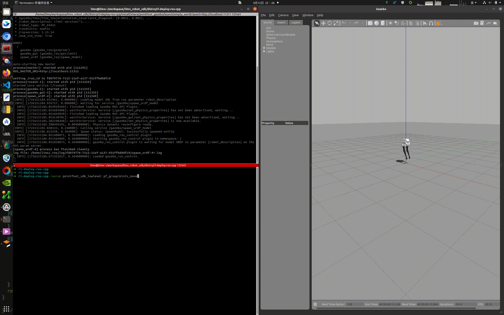

# [中文](README_cn.md) | English
# tron1-gazebo-ros
## 1. Set up the Development Environment 

Install ROS Noetic: Set up a ROS Noetic-based algorithm Development Environment on the Ubuntu 20.04 operating system. For installation, please refer to the documentation: https://wiki.ros.org/noetic/Installation/Ubuntu , and choose "ros-noetic-desktop" for installation. After the installation of ROS Noetic is completed, enter the following Shell commands in the Bash end point to install the libraries required by the Development Environment:
```
sudo apt-get update
sudo apt install ros-noetic-urdf \
                 ros-noetic-kdl-parser \
                 ros-noetic-urdf-parser-plugin \
                 ros-noetic-hardware-interface \
                 ros-noetic-controller-manager \
                 ros-noetic-controller-interface \
                 ros-noetic-controller-manager-msgs \
                 ros-noetic-control-msgs \
                 ros-noetic-ros-control \
                 ros-noetic-gazebo-* \
                 ros-noetic-robot-state-* \
                 ros-noetic-joint-state-* \
                 ros-noetic-rqt-gui \
                 ros-noetic-rqt-controller-manager \
                 ros-noetic-plotjuggler* \
                 cmake build-essential libpcl-dev libeigen3-dev libopencv-dev libmatio-dev \
                 python3-pip libboost-all-dev libtbb-dev liburdfdom-dev liborocos-kdl-dev -y
```

## 2. Create Workspace

You can create an algorithm development workspace by following these steps: 
- Open a Bash end point.
- Create a new directory to store the workspace. For example, you can create a directory named "limx_ws" under the user's home directory:

  ```
  mkdir -p ~/limx_ws/src
  ```

- Download the Motion Control Development Interface:

  ```
  cd ~/limx_ws/src
  git clone https://github.com/limxdynamics/limxsdk-lowlevel.git
  ```

- Download Gazebo Simulator:

  ```
  cd ~/limx_ws/src
  git clone https://github.com/limxdynamics/tron1-gazebo-ros.git
  ```

- Download the robot model description file

  ```
  cd ~/limx_ws/src
  git clone https://github.com/limxdynamics/robot-description.git
  ```

- Compile Project:

  ```
  cd ~/limx_ws
  catkin_make install
  ```

- Select robot type

  - List available robot types via the Shell command tree -L 1 src/robot-description/pointfoot : 

    ```
    src/robot-description/pointfoot
    ├── PF_P441A
    ├── PF_P441B
    ├── PF_P441C
    ├── PF_P441C2
    ├── PF_TRON1A
    ├── SF_TRON1A
    └── WF_TRON1A
    ```

  - TakingPF_P441C (please replace it according to the actual robot type) as an example, set the robot model type:

    ```
    echo 'export ROBOT_TYPE=PF_P441C' >> ~/.bashrc && source ~/.bashrc
    ```

- Run the simulation: You can set the use_support parameter of the empty_world.launch.py file to true, and execute the following Shell command to run the simulation:

  ```
  source install/setup.bash
  roslaunch pointfoot_gazebo empty_world.launch
  ```

- Run the control routine to ensure that the robot in the simulator is moving, indicating that the simulation environment has been successfully set up:

  ```
  source install/setup.bash
  rosrun limxsdk_lowlevel pf_groupJoints_move
  ```
  
